# MLOps Pipeline for Scalable Model Training and Deployment

## Overview

A Docker and Kubernetes-ready MLOps pipeline for:

- Distributed hyperparameter tuning with cross-validation
- Model tracking via MLFlow (PostgreSQL + S3 backend)
- Scalable deployment options (Docker & Kubernetes)
- Production inference API with load balancing

## Prerequisites

- Docker
- Docker Compose
- Kubernetes cluster (optional)
- MLFlow tracking server
- MinIO (or S3-compatible storage)
- PostgreSQL

## Feature Architecture

```
Training Pipeline:
└── Hyperparameter Runs →
     ├── Docker containers (single node)
     └── Kubernetes pods (multi-node)
     └── MLFlow Tracking (PostgreSQL + MinIO)

Inference Pipeline:
└── MLFlow Model Serving →
     ├── Docker container
     └── Kubernetes replicas + Ingress
```

## Pipeline Structure



## Setup & Usage

### 1. Start Infrastructure

```bash
make mlflow-init
```

Starts MLFlow, PostgreSQL, MinIO

### 2. Run Training Jobs

Docker-based training:

```bash
make train-docker
```

Kubernetes-based training:

```bash
make train-kubernetes
```

### 3. Model Selection

```bash
make select-model
```

Selects the best model based on filters defined in `src/model_query/metrics_config.yaml`.

### 4. Deploy Models

Docker deployment:

```bash
make prod-docker
```

Kubernetes deployment (with replica scaling):

```bash
make prod-kubernetes
```

### 5. Inference - Single Input

```bash
make inference-one-input
```

## Makefile Targets

| Target            | Description                          |
|-------------------|--------------------------------------|
| mlflow-init       | Start MLFlow infrastructure          |
| mlflow-remove     | Stop and clean MLFlow infrastructure |
| build-train       | Build training container             |
| build-prod        | Build production container           |
| train-docker      | Run training in multiple Docker containers (single node)               |
| train-kubernetes  | Run training in multiple Kubernetes pods (multiple nodes)                |
| select-model      | Select best model                    |
| prod-docker       | Deploy model in Docker container     |
| prod-kubernetes   | Deploy model in Kubernetes           |
| inference-one     | Run inference on single input        |
| generate-data     | Generate synthetic data              |
| compose-logs      | View container logs                  |

## Configuration

- Set model registry location in `src/orchestrators/`
- Configure Kubernetes manifests for scaling
- Update MinIO credentials in `compose.yaml`
